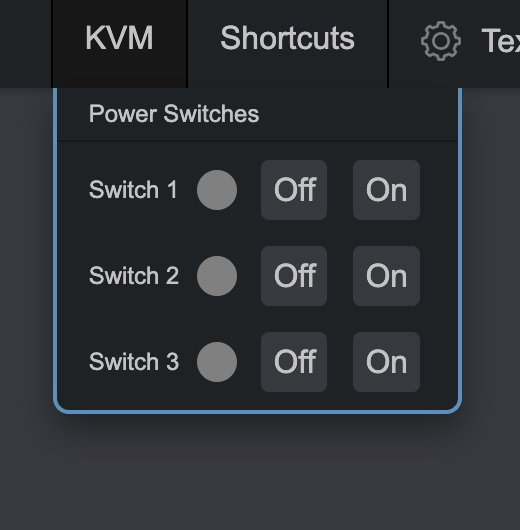

# PiKVM Tapo Plug

This repo is a small showcase for how to use TP-Link Tapo P100 Devices (and others, send a PR!) to be used with PiKVM.

Using the sample configuration (with 3 plugs) renders the following output:

## Prerequisites

Your Tapo plugs must be registered and online. You'll need their IP addresses to then put into the PiKVM override file

## Installation

To install on the PiKVM, run the following commands:

1. SSH in as root, or use the web terminal, then `su` and enter root password
2. Go into rw mode: `rw`
3. `mkdir -p /opt/tapo`
4. `pacman -S python-pip`
5. `pip3 install tapo --break-system-packages`
6. Put main.py into `/opt/tapo/main.py`
7. Update your `/etc/kvmd/override.yaml` to contain something similar to the example (`override.example.yaml`) in this repo.
8. Put device back into ro mode: `ro`
9. Restart kvmd: `systemctl restart kvmd`

## Configuration

The script also supports a "toggle" action, which turns the plug off, waits 2 seconds then turns it back on again. Update the `override.yaml` as necessary for this to function.

## Misc

In progress is a proper PiKVM-plugin, currently you have to manually install this to `/usr/lib/python3.12/site-packages/kvmd/plugins/ugpio/tapo.py` from the `plugin.py` file in this repository. An example override is in `override.plugin.yaml`